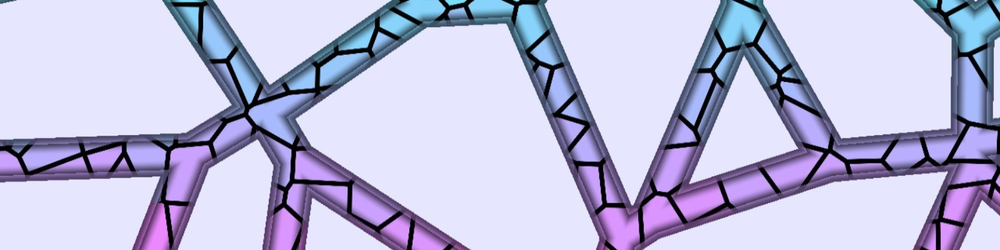

# Vulkan compute shaders player

A simple program to run Vulkan compute shaders and modify them in real time.

## How to build?
To build this project you need to have Vulkan and SDL2 installed on your machine
1) Clone repo
2) Go to project's root directory
3) `mkdir build`
4) `cd build`
5) `cmake .. -DSDL2_DIR=[PATH TO SDL]`
6) use generated build files

> [!WARNING]  
> If you encounter errors related to `SDL2.dll` being unavailable, try copying `SDL2.dll` to the directory containing the executable file.